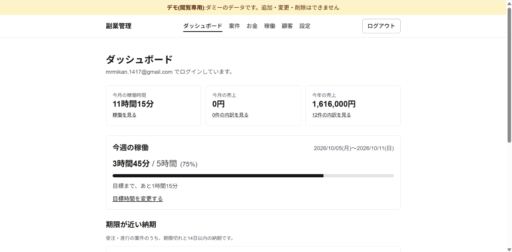
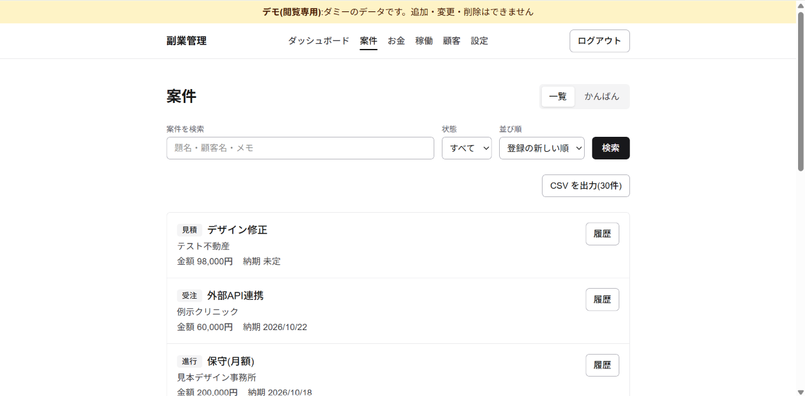
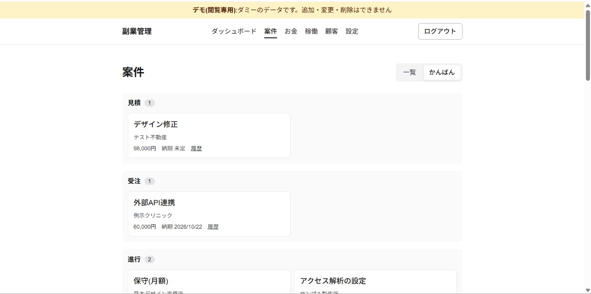
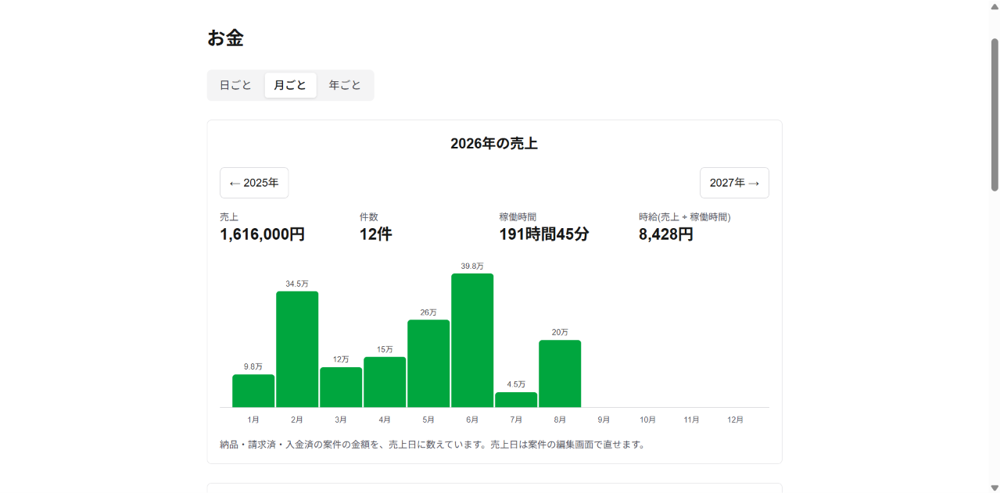
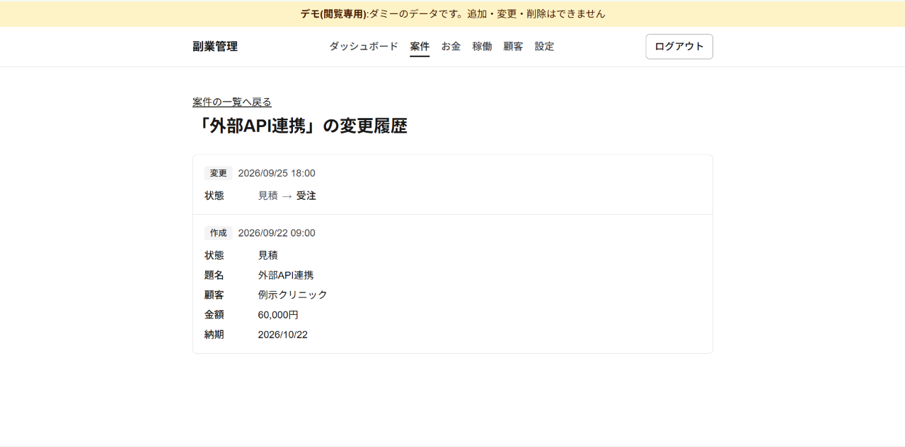
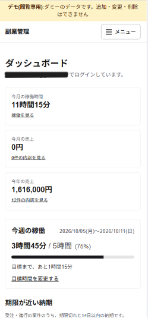
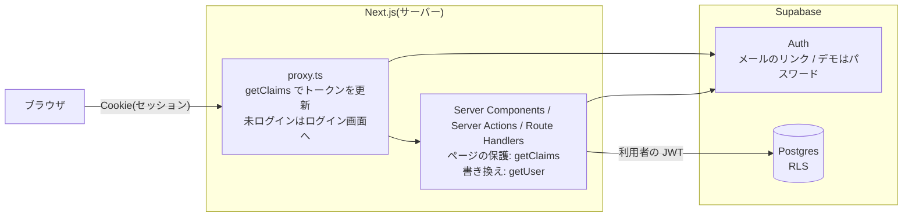
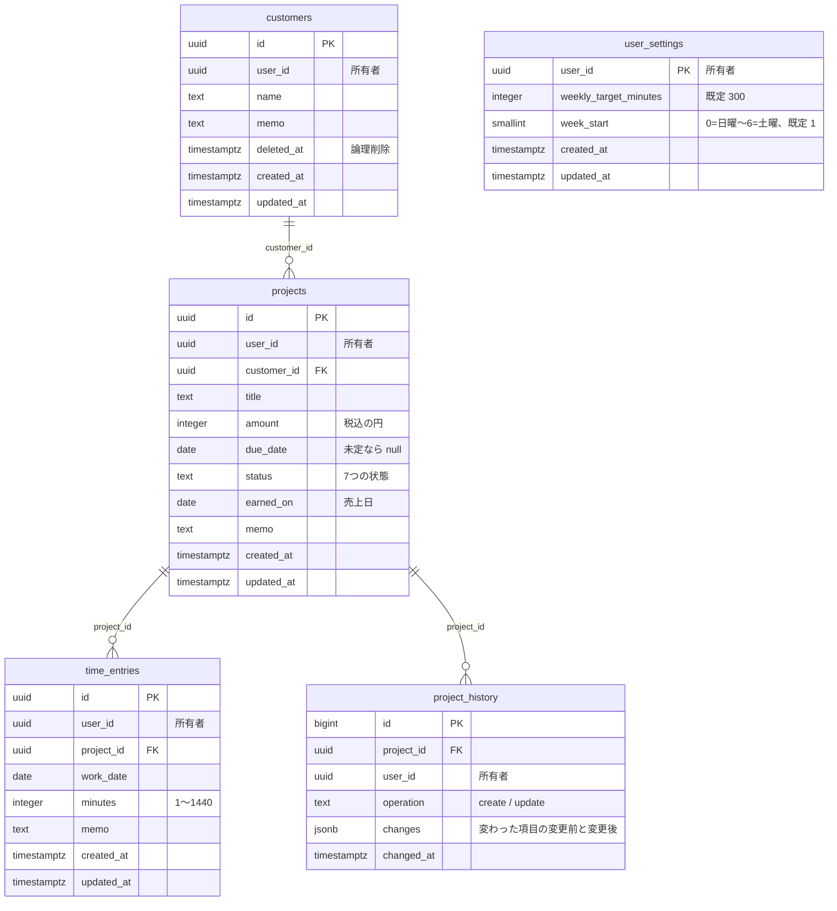

# side-biz-dashboard

副業の案件・売上・稼働時間を管理するダッシュボード。

公開デモ: https://side-biz-dashboard-1wuz.vercel.app
(閲覧専用・ダミーのデータ・ポートフォリオ用のデモ)

## 画面

ダッシュボード。今月の稼働時間、今月と今年の売上、今週の稼働目標の消化を表示する。

案件の一覧。検索、状態での絞り込み、並び替え、CSV出力、変更履歴へのリンク。

かんばん。状態ごとの列に案件を表示する。

お金。日ごと・月ごと・年ごとの売上の棒グラフと、件数・稼働時間・時給。

案件の変更履歴。作成と変更(変更前 → 変更後)を新しい順に表示する。

スマホ幅のダッシュボード。メニューはボタンで開く。

## なぜ作ったか

TODO-WRITE

## 機能一覧

要件の詳細と業務ルールは [docs/requirements.md](docs/requirements.md) を参照。

| ID | 機能 | 内容 |
| --- | --- | --- |
| F1 | ログイン・ログアウト | メールのリンクでログインする。未ログインでは保護された画面に入れず、ログイン画面に移す |
| F2 | データの分離 | 他人のデータは、読むことも書くこともできない(API を直接呼んでも拒否される) |
| F3 | 顧客の管理 | 名前とメモ。作成・編集・削除(論理削除) |
| F4 | 案件の管理 | 顧客、題名、金額、納期、状態、メモ。新しい案件は見積から始まり、状態は自由に変更できる |
| F5 | かんばん表示 | 状態ごとの列で表示し、ボタンで次の状態へ進める・1つ前に戻す |
| F6 | 稼働時間の記録 | 案件ごとに、日付と時間(分単位)を記録・編集・削除する |
| F7 | 週の目標と達成 | 週の最低の目標時間(初期5時間)を設定し、消化率を表示する。目標に届いたら達成(超えても達成のまま) |
| F8 | お金の管理 | 納品・請求済・入金済の案件の金額を、売上日の売上として日ごと・月ごと・年ごとに合計し、棒グラフで表示する。期間の時給、これから入る見込み、期間の案件の一覧。請求の管理は廃止した |
| F9 | ダッシュボード | 今月の稼働時間、今月と今年の売上、週の目標の消化、期限が近い納期、状態別の案件数 |
| F10 | 一覧の操作 | 案件・顧客・稼働の検索、絞り込み、並び替え、ページ分割(10件)、空状態の表示 |
| F11 | 入力検証 | 画面とサーバーで同じ検証関数を使い、エラーは項目ごとに表示する |
| F12 | レスポンシブと状態表示 | スマホ幅で主要な操作ができる。読み込み中・エラー・空状態の表示を統一する |
| F13 | デモモード | 本番と別の環境に、ダミーのデータと共有の閲覧専用アカウントを用意する |
| F14 | CSV出力 | 案件・稼働を、一覧の今の条件のまま全件出力する |
| F15 | 変更履歴 | 案件の、いつ何が変わったかを一覧で見られる |

F16〜F18(Stripeのテスト決済、請求書のPDF出力、期限のリマインド)は、v1では実装しない。

## 技術と選定理由

| 技術 | 用途 | 選定理由 |
| --- | --- | --- |
| Next.js 16(App Router)/ React 19 | 画面とサーバー(Server Components、Server Actions、Route Handlers、`proxy.ts`) | 要確認 |
| TypeScript | 全体 | 要確認 |
| Tailwind CSS 4 | スタイル | 要確認 |
| Supabase(Auth、Postgres、RLS) | 認証とデータベース | 認証は外部サービスに任せ、認可をデータベース側でも強制するため |
| `@supabase/ssr` / `@supabase/supabase-js` | サーバーから Supabase を使う | セッションを Cookie で持つため(`@supabase/ssr`)。`@supabase/supabase-js` は要確認 |
| Zod 4 | 入力検証 | 画面とサーバーで同じ検証関数を使うため |
| Vitest / Testing Library / jsdom | ユニットテスト、結合テスト | 要確認 |
| `pg` | 結合テストで、ローカルの DB に直接つなぐ | 利用者の API では変えられない `app_metadata`(閲覧専用の印)を、テストで準備するため |
| Supabase CLI | ローカルの Supabase の起動、マイグレーションの適用、型の生成 | 要確認 |
| ESLint | lint | 要確認 |
| GitHub Actions | CI(PRごとの lint・型チェック・テスト・ビルド・結合テスト)、毎週の依存の監査 | 要確認 |
| Vercel | 公開デモの置き場所 | 要確認 |

売上の棒グラフは、ライブラリを使わずに描いている(理由: 要確認)。

## 構成図

ブラウザから Supabase へは直接つながず、すべて Next.js のサーバーを通す。サーバーは publishable key と利用者のセッションで Supabase を呼ぶので、DB の RLS が利用者ごとに効く。

## ER図

- すべてのテーブルの `user_id` は `auth.users` を参照する(図では省略)。
- 外部キーは `(customer_id, user_id)`・`(project_id, user_id)` の複合で張り、同じ所有者の顧客・案件しか指定できない。
- `projects.earned_on` は、状態が納品・請求済・入金済のときだけ値を持つ(check 制約)。

## 認可の設計

### RLS

- 5つのテーブルすべてで RLS を有効にし、ポリシーは「本人の行だけ」(`(select auth.uid()) = user_id`)。更新は `using` と `with check` の両方で判定し、`user_id` を他人に書き換えられないようにしている。
- 未ログイン(`anon`)には、どのテーブルの権限も渡さない。ログイン済み(`authenticated`)には、必要な操作の権限だけを渡す。

| テーブル | 読む | 追加 | 更新 | 削除 |
| --- | --- | --- | --- | --- |
| `customers` | ○ | ○ | ○ | ○ |
| `projects` | ○ | ○ | ○ | -(不要な案件は失注にする) |
| `time_entries` | ○ | ○ | ○ | ○ |
| `user_settings` | ○ | ○ | ○ | - |
| `project_history` | ○ | - | - | - |

- 外部キーの確認は RLS を通らないため、複合の外部キーで「同じ所有者の顧客・案件」であることを保証している。
- 新しい案件が見積から始まることは、DB のトリガーでも強制している。

### 閲覧専用の3層

閲覧専用は、Auth の `app_metadata.read_only` で判定する(`app_metadata` は本人には変えられない)。

- DB
  - `is_read_only()` が JWT の `app_metadata.read_only` を読む。restrictive のポリシーが「本人の行だけ」のポリシーと AND で組み合わさり、`customers`・`projects`・`time_entries`・`user_settings` の追加・更新・削除を拒否する。
  - `auth.users` のトリガー(`protect_read_only_user`)で、閲覧専用のアカウントのパスワード・メールアドレス・電話番号の変更を拒否する(共有アカウントの乗っ取り防止)。管理者が SQL で変えるのは許可する。
- サーバー
  - データを書き換える Server Action は、`requireUser()`(`getUser()` で毎回 Auth サーバーに問い合わせる)で閲覧専用を拒否する。
  - 新規作成・編集の画面は、`verifyWritableSession()` で案内の画面へ転送する。
- 画面
  - 追加・編集・削除・状態の変更のボタンを出さない。

### 履歴を利用者が書き換えられない設計

- `project_history` には、利用者に `select` の権限だけを渡す(追加・変更・削除の権限はない)。
- 記録は、`projects` の作成・変更のあとに動くトリガー(`record_project_history`)が行う。関数は `security definer` で所有者の権限で書き込み、利用者・未ログインには実行の権限を渡さない。
- 記録する値は、トリガーが受け取った行だけから作る。記録する項目は、状態・題名・顧客・金額・納期・売上日・メモ。値が変わらない更新は記録しない。
- 画面からでも API を直接呼んでも、必ず記録が残る。

## 設計で工夫した点

TODO-WRITE

## 要件を変えた判断

[docs/requirements.md の「要件の変更履歴」](docs/requirements.md#要件の変更履歴)

TODO-WRITE

## テスト

| 種類 | 場所 | 役割 | 件数 |
| --- | --- | --- | --- |
| ユニット | `src/**/*.test.{ts,tsx}` | 業務ロジック(状態、集計、週の計算、検証、CSV、一覧の条件、認可の判定など)と画面の部品を、jsdom で確かめる | 514件(45ファイル) |
| 結合 | `tests/integration/*.test.ts` | ローカルの Supabase に実際にリクエストを送り、RLS によるデータの分離、閲覧専用、変更履歴、データの読み書きを確かめる | 88件(10ファイル) |
| E2E | - | 未実装 | - |

件数は 2026-10-10 に `npm run test` と `npm run test:integration` を実行して数えた。

実行方法:

- ユニット: `npm run test`
- 結合: `npx supabase start` のあと `npm run test:integration`

CI(GitHub Actions)では、PRごとに両方を実行する。

## 起動
1. `cp .env.example .env.local` して、Supabaseの値を入れる
2. `npm ci`
3. `npm run dev`

## 検証
`npm run lint && npm run typecheck && npm run test && npm run build`

結合テスト(ローカルの Supabase に、実際にリクエストを送る):
`npx supabase start` のあと `npm run test:integration`。
閲覧専用のテストは、ローカルの DB に直接つないでユーザーに印を付ける(ローカル以外の DB には接続しない)。

## 公開デモの作り方
公開デモは、本番とは**別の** Supabase プロジェクトと Vercel プロジェクトで動かす。
データはダミーだけで、訪問者は共有の閲覧専用アカウントでログインする(追加・変更・削除はできない)。

1. デモ用の Supabase プロジェクトを作り、`supabase/migrations` を適用する(`npx supabase link` → `npx supabase db push`)
2. Authentication の設定
   - 新規登録を止める(Sign In / Providers の "Allow new users to sign up" をオフ)
   - Email の "Secure email change" をオンにする
3. Authentication > Users で、デモ用のユーザーを作る(メールアドレスとパスワード、Auto Confirm)
   - パスワードは長いランダムな値にし、リポジトリには書かない
4. `supabase/demo/seed.sql` の `demo_email` をそのアドレスにして、SQL Editor で実行する
   - そのユーザーが閲覧専用になり、ダミーのデータが入る。何度実行しても、同じ状態に作り直す(日付は実行日が基準)
5. Vercel のデモ用プロジェクトに、環境変数を設定する
   - `NEXT_PUBLIC_SUPABASE_URL` / `NEXT_PUBLIC_SUPABASE_PUBLISHABLE_KEY`: デモ用プロジェクトの値
   - `SITE_URL`: デモの URL
   - `DEMO_MODE=true` / `DEMO_EMAIL` / `DEMO_PASSWORD`(**`NEXT_PUBLIC_` を付けない**。ブラウザには送られない)

デモモードでは、ログイン画面に「デモを見る(閲覧専用)」のボタンだけを出し、メールでのログインは受け付けない。

閲覧専用は、次の3か所で強制している。
- DB: `app_metadata.read_only` が true のユーザーは、RLS(restrictive のポリシー)で書き込めない。
  パスワード・メールアドレスも変えられない(共有アカウントの乗っ取り防止)。`app_metadata` は本人には変えられない
- サーバー: データを書き換える Server Action は、`requireUser()` で拒否する。新規作成・編集の画面は案内の画面へ転送する
- 画面: 追加・編集・削除・状態の変更のボタンを出さない

## 既知の課題
- 開発用のlintツールの依存に、既知の脆弱性の警告がある(本番の依存は0件)。上流の更新待ち。
- 公開デモは共有アカウントなので、誰かが「全端末からログアウト」を実行すると、ほかの訪問者もログアウトされる(もう一度ボタンを押せば入れる)。
